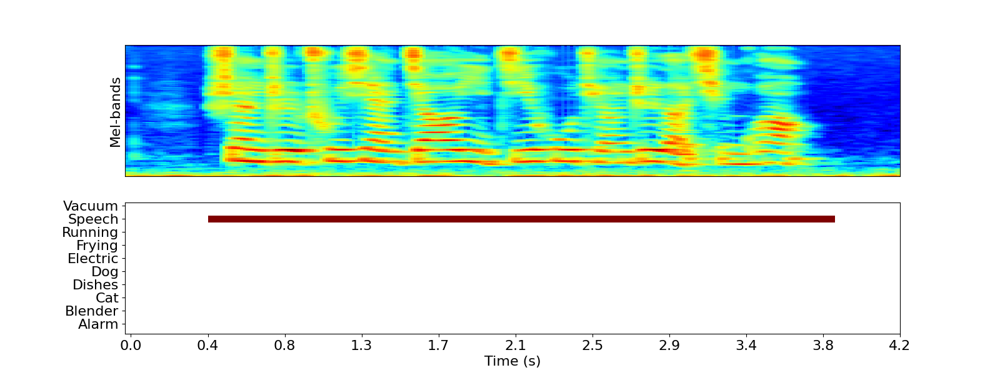
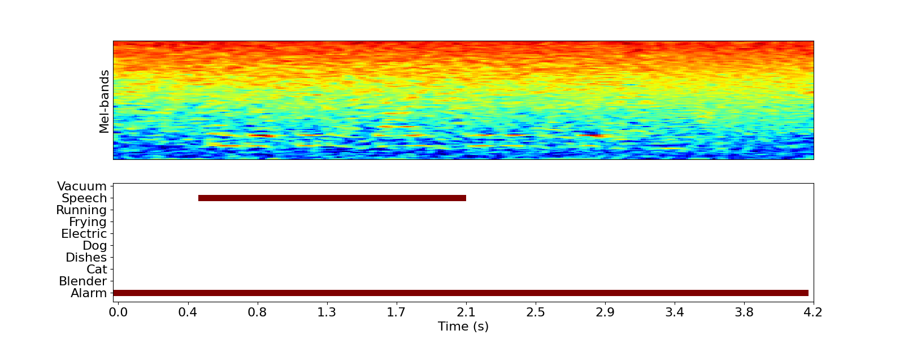
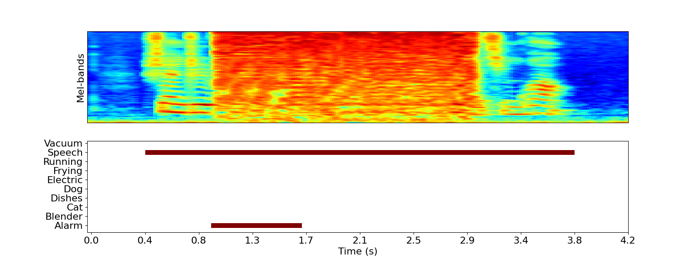
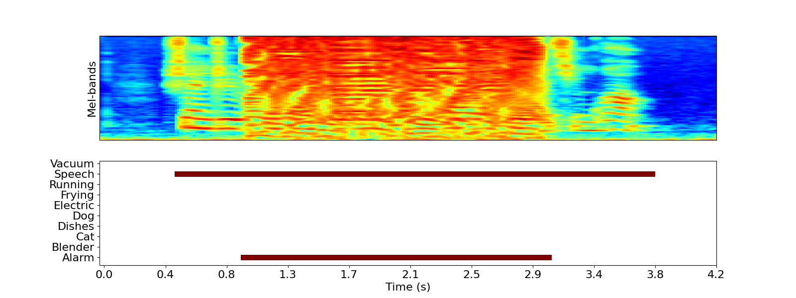

# Mirage Fools the Ear, Mute Hides the Truth: Precise Targeted Adversarial Attacks on Polyphonic Sound Event Detection Systems

This repository provides the implementation of $\mathrm{M^2A}$:, a framework for **targeted adversarial attacks** on **polyphonic Sound Event Detection (SED) systems**. The code is made available **exclusively for reproducibility checks.

🔹 **Setup details for ATST-SED and CRNN can be found in their respective README files.**

---

## Demos on Attack Performance of different methods

Attacker's goal is to activate event 'alarm' from 1.0 to 3.0s.

### Original Output



### C&W Attack



### FAAG



### $\mathrm{M^2A}$ (Ours)



## 📁 Repository Structure

```
M2A/
├── ATST-SED
│   ├── desed_task                     # Official implementation of ATST-SED by original authors
│   ├── train
│   │   ├── confs                      # Configuration file that sets local model paths
│   │   ├── local            
│   │   └── val_utils
│   ├── arbitrary_attack.py            # Multi-target attack against ATST-SED
│   ├── attack.py                      # Single-target attack against ATST-SED
│   ├── inference.py                   # Inference script for visualization (from ATST-SED authors)
│   ├── conda_create_environment.sh    # Conda env setup script (from ATST-SED authors)
│   ├── README.md                      # Setup details for ATST-SED (from ATST-SED authors)
│   └── setup.py                       # Install dependencies for ATST-SED (from ATST-SED authors)
├── sed-crnn
│   ├── arbitrary_attack.py            # Multi-target attack against CRNN
│   ├── attack.py                      # Single-target attack against CRNN
│   ├── crnn.py                        # CRNN implementation and training script (pytorch version derived from CRNN authors)
│   ├── feature.py                     # Feature extraction script
│   ├── README.md                      # Setup details for CRNN (from CRNN authors)
│   └── utils.py
├── README.md                          # This file
└── requirements.txt                   # Dependencies for the attack framework
```

---

## 🛠 Setup

### **ATST-SED**

Refer to `ATST-SED/README.md` for details on setting up and running ATST-SED.
The original ATST-SED implementation is used, and its environment can be set up using:

```bash
cd ATST-SED
bash conda_create_environment.sh
```

### **CRNN**

Refer to `sed-crnn/README.md` for details on setting up and training the CRNN model.
Install dependencies using:

```bash
pip install -r requirements.txt
```

---

## 🚀 Evaluate Attack Performance

### **1️⃣ Single-Target Editing Attack against ATST-SED**

```bash
python ATST-SED/attack.py
```

### **2️⃣ Single-Target Editing Attack against CRNN**

```bash
python sed-crnn/attack.py
```

### **3️⃣ Multi-Target Editing Attack**

```bash
python ATST-SED/arbitrary_attack.py
```

or

```bash
python sed-crnn/arbitrary_attack.py
```

---

## 📌 Notes

- Details of ATST-SED and CRNN setups can be found in their respective directories.
- Identifying information has been removed to comply with **double-blind review policies**.
- The repository will be **updated post-review** if necessary.

For any issues, please open an **anonymous GitHub issue**.
